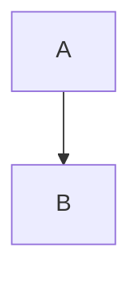

# Manual Completo de Markdown

Este manual é um guia **completo, prático e estruturado** sobre Markdown. Ele serve tanto para iniciantes quanto para uso profissional em **README.md, documentação técnica, projetos de engenharia, instruções para IA, Firebase Studio, GitHub, Notion e afins**.

---

## 1. O que é Markdown

Markdown é uma linguagem de marcação **leve**, criada para escrever texto formatado usando **texto puro**.

Objetivos principais:

* Facilidade de leitura
* Escrita rápida
* Compatibilidade com humanos e máquinas
* Conversão simples para HTML, PDF, DOC, etc.

---

## 2. Princípios Fundamentais

* Markdown não é programação
* Markdown não executa lógica
* Markdown depende de **símbolos simples**
* Markdown é interpretado pelo renderizador (GitHub, ChatGPT, Notion, etc.)

---

## 3. Títulos (Headings)

```
# Título nível 1
## Título nível 2
### Título nível 3
#### Título nível 4
##### Título nível 5
###### Título nível 6
```

Boas práticas:

* Use apenas **um H1 por documento**
* Não pule níveis sem motivo

---

## 4. Parágrafos e Quebras de Linha

* Uma linha vazia cria um novo parágrafo
* Quebra de linha simples não cria novo parágrafo

```
Texto linha 1
Texto linha 2

Novo parágrafo
```

---


obs: você pode quebrar uma linha dando espaços no final de uma linha e clicar ENTER, isso garante que o que vem abaixo não ficará na mesma linha  


## 5. Ênfase de Texto

```
**Negrito**
*Itálico*
***Negrito e itálico***
~~Texto riscado~~
```

---

## 6. Listas

### 6.1 Listas Não Ordenadas

```
- Item
- Item
  - Subitem
  - Subitem
```

Também pode usar `*` ou `+`.

### 6.2 Listas Ordenadas

```
1. Primeiro
2. Segundo
3. Terceiro
```

---

## 7. Links

```
[Texto do link](https://exemplo.com)
```

Com título opcional:

```
[Link](https://exemplo.com "Descrição")
```

---

## 8. Imagens

```

```

Com caminho local:

```

```

---

## 9. Código

### 9.1 Código Inline

```
Use o comando `npm install`
```

### 9.2 Bloco de Código

````
```js
console.log("Hello World")
```
````

Linguagens comuns:

* bash
* js
* ts
* json
* yaml
* html
* css
* md

---

## 10. Citações (Blockquotes)

```
> Isto é uma citação
```

Aninhado:

```
> Nível 1
>> Nível 2
```

---

## 11. Checklists (Task Lists)

```
- [x] Tarefa concluída
- [ ] Tarefa pendente
```

Muito usado em:

* Projetos
* Planejamento
* Roadmaps

---

## 12. Tabelas

```
| Coluna | Tipo | Descrição |
|-------|------|-----------|
| id    | int  | Identificador |
```

Alinhamento:

```
| Esquerda | Centro | Direita |
|:--------|:------:|--------:|
```

---

## 13. Separadores (Horizontal Rule)

```
---
```

Também aceita:

* `***`
* `___`

---

## 14. Escape de Caracteres (Desativar Markdown)

```
\# Não vira título
\* Não vira itálico
\` Não vira código
```

---

## 15. HTML dentro do Markdown

Markdown aceita HTML puro:

```
<div style="color:red">Texto vermelho</div>
```

⚠️ Nem todos os renderizadores permitem HTML.

---

## 16. Comentários (não visíveis)

```
<!-- Isso é um comentário -->
```

---

## 17. Emojis

```
🚀 🔥 ✅ ❌
```

Ou códigos:

```
:rocket: :fire:
```

---

## 18. Arquivos Markdown

Extensões comuns:

* `.md`
* `.markdown`

Arquivos populares:

* README.md
* CHANGELOG.md
* CONTRIBUTING.md

---

## 19. Boas Práticas Profissionais

* Clareza acima de estética
* Estrutura lógica
* Consistência
* Pensar no leitor (humano ou IA)

---

## 20. Markdown para IA (Uso Avançado)

Markdown bem estruturado:

* melhora interpretação da IA
* reduz ambiguidades
* funciona como pseudo-DSL

Exemplo:

```
## Objetivo

## Restrições

## Passos

## Resultado Esperado
```

---

## 21. Quando NÃO Usar Markdown

Evite quando:

* Texto vai direto para banco de dados
* UI não possui parser
* Conteúdo deve ser literal

---

## 22. Conclusão

Markdown é uma **linguagem de organização do pensamento**.

Quem domina Markdown:

* documenta melhor
* pensa melhor
* ensina melhor
* comanda melhor IAs

---

## 23. Referências de Renderizadores

Markdown pode variar conforme o renderizador.

Renderizadores comuns:

* GitHub Flavored Markdown (GFM)
* CommonMark
* Markdown Extra
* Notion Markdown
* Obsidian Markdown
* ChatGPT Markdown

Diferenças comuns:

* Suporte a tabelas
* Suporte a HTML
* Checklists
* Emojis

---

## 24. GitHub Flavored Markdown (GFM)

Recursos extras do GitHub:

* Task Lists
* Tabelas avançadas
* Autolinks
* Syntax Highlighting aprimorado

Exemplo de autolink:

```
https://github.com
```

---

## 25. Âncoras e Links Internos

Títulos geram âncoras automaticamente.

Exemplo:

```
[Ir para Títulos](#3-títulos-headings)
```

Regras:

* Letras minúsculas
* Espaços viram hífen
* Caracteres especiais são removidos

---

## 26. Notas de Rodapé (quando suportado)

```
Texto com nota[^1]

[^1]: Texto da nota
```

---

## 27. Definições (Definition Lists)

Quando suportado:

```
Termo
: Definição
```

---

## 28. Blocos Admonition (Alertas)

Nem todo Markdown suporta, mas padrão comum:

```
> ⚠️ Atenção
> Isso é um aviso importante
```

Ou em plataformas específicas:

```
:::warning
Texto
:::
```

---

## 29. Colapsáveis (quando suportado)

```
<details>
<summary>Clique para expandir</summary>

Conteúdo oculto

</details>
```

---

## 30. Diagramas (Mermaid – quando suportado)

````

````

Usado em:

* GitHub
* Obsidian
* Docs técnicas

---

## 31. Math / LaTeX (quando suportado)

Inline:

```
$E = mc^2$
```

Bloco:

```
$$
a^2 + b^2 = c^2
$$
```

---

## 32. Front Matter (Metadados)

Usado em blogs, docs e sites estáticos:

```
---
title: Manual Markdown
author: Claudemir Silva
date: 2025-12-30
---
```

---

## 33. Organização de Documentos Grandes

Boas práticas:

* Índice no topo
* Seções numeradas
* Um tema por seção
* Uso de separadores

Exemplo de índice:

```
## Índice
- [Introdução](#1-o-que-é-markdown)
- [Títulos](#3-títulos-headings)
```

---

## 34. Markdown como Linguagem de Projeto

Markdown pode ser usado como:

* Especificação técnica
* Documento de arquitetura
* Contrato de regras
* Prompt estruturado para IA

Estrutura recomendada:

```
## Contexto
## Objetivo
## Restrições
## Entradas
## Processamento
## Saídas
```

---

## 35. Padrões para Times e Empresas

Sugestões:

* Um padrão de títulos
* Um padrão de listas
* Um padrão de alertas
* Um padrão de código

Criar um `MARKDOWN_GUIDE.md` interno.

---

## 36. Conversão de Markdown

Markdown pode ser convertido para:

* HTML
* PDF
* DOCX
* Slides

Ferramentas:

* Pandoc
* Typora
* Obsidian
* VS Code

---

## 37. Erros Comuns

* Misturar níveis de título
* Blocos de código mal fechados
* Tabelas desalinhadas
* Excesso de formatação

---

## 38. Segurança e Markdown

Atenção:

* HTML pode ser bloqueado
* Scripts não executam
* Markdown não é sandbox

---

## 39. Markdown Minimalista vs Verboso

Minimalista:

* Poucos símbolos
* Mais leitura

Verboso:

* Mais estrutura
* Mais controle

Escolha conforme o contexto.

---

## 40. Conclusão Final

Markdown é mais que formatação.

É:

* organização de pensamento
* linguagem de documentação
* ponte entre humano e máquina

Quem domina Markdown domina **clareza**.

---

## Forçar quebra de linha
`<br>` serve para forçar uma quebra de linha.

Ele vem do HTML, mas funciona também dentro de Markdown na maioria dos renderizadores.

## 📌 O que o `<br>` faz

Ele quebra a linha sem criar um novo parágrafo.

Compare:

### Sem `<br>`

Linha 1  
Linha 2

➡️ Isso vira um único parágrafo.

### Com `<br>`

Linha 1<br>
Linha 2

➡️ Isso vira:

Linha 1  
Linha 2

## 🧠 Diferença importante

| Forma | O que acontece |
|------|---------------|
| Linha em branco | Novo parágrafo |
| `<br>` | Apenas quebra de linha |
| Dois espaços + Enter | Quebra de linha (Markdown puro) |

### Exemplo Markdown puro

Linha 1␠␠  
Linha 2

## ✅ Quando usar `<br>`

Use `<br>` quando você precisa:

- Controlar exatamente a quebra de linha
- Manter tudo no mesmo parágrafo
- Escrever:
  - poesia
  - letras
  - endereços
  - listas visuais
  - textos densos

### Exemplo

Nome: Claudemir Silva<br>
Cargo: Desenvolvedor<br>
Stack: Firebase · Next · IA

## ❌ Quando NÃO usar `<br>`

Evite quando:

- estiver escrevendo documentação longa
- quiser semântica correta
- puder usar parágrafos ou listas

### Prefira:

- Nome: Claudemir Silva
- Cargo: Desenvolvedor
- Stack: Firebase · Next · IA


**Fim do Manual**
